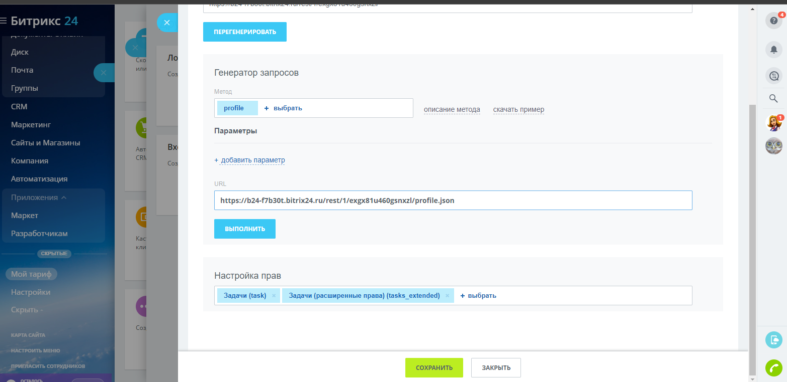

# Пример разбор API запросов для Bitrix24

### Документация к Bitrix24 https://dev.1c-bitrix.ru/rest_help/rest_sum/index.php

## Авторизация и получение Access Token (использовал вебхук)

Для получения вебхука использую демо тариф на 15 дней

после этого перехожу на вкладку разработчик->другое->входящий вебхук

Здесь в настройках можно искать нужные методы но я смотрел в документации потому что из доступных методов есть устаревшие

Верхняя или нижня строка Url и есть вебхук с продолжением енд пойнтов

нужно задать права а затем сохранить(без прав у вас не будет доступа к задачам)

После этого запускаю Advanced REST client и с помощью запроса вытаскиваю определённую задачу

Завожу новую задачу:

Как мы видим задача создалась:

Изменяю существующую задачу:

Удаляю задачу:

