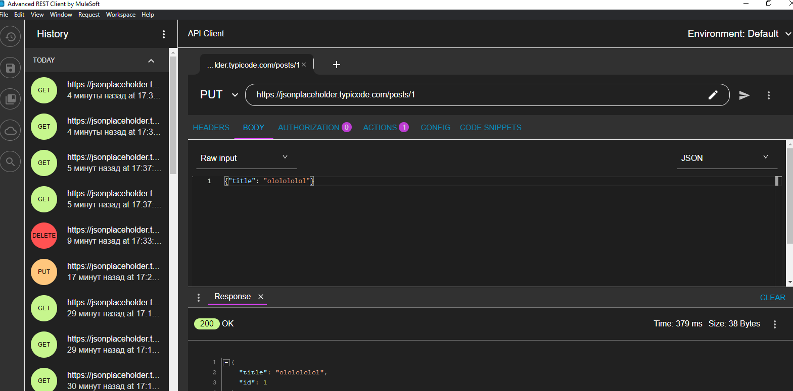

# REST-API

### Uses portal jsonplaceholder
#### Ссылка для просмотра API документации: https://jsonplaceholder.typicode.com/

Запрос на получение данных GET: https://jsonplaceholder.typicode.com/posts/1/comments


Запрос на заведение данных POST: https://jsonplaceholder.typicode.com/posts

Использовался JSON : 
```json
{"title": "Olehg"}
```


Запрос на заведение данных PUT: https://jsonplaceholder.typicode.com/posts/1



Запрос на удаление данных DELETE: https://jsonplaceholder.typicode.com/posts/1


